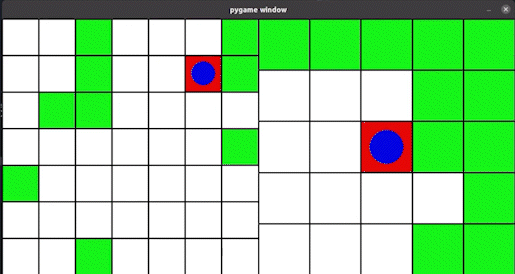

# RL_explore_problem

- 任務
  - 左邊為實際地圖，右邊為機器人(藍點)實際能見地圖，獵物(紅點)隨機移動，在不建地圖的情況下觸碰到獵物。

- Define
  - environment :
    - 藍點   : 機器人 
    - 紅方塊 ： 獵物
    - 綠方塊 ： 牆壁
    - 白方塊 ： 可行走地板
  - state （5*5 矩陣） :
    - 0 : 可行走地板
    - 1 : 牆壁
    - 2 : 獵物
  - reward ：
    - 到終點 = 200
    - 撞到牆壁 = -10
    - 每走一步看到的資訊量 = Info(state,action)_

- 特色
  - 使用DQN，再未訓練過地形(未知state)也能依靠過往經驗做出決斷。

  - 使用自創資訊量做了兩種測試：
    - 依靠看到的資訊量給予reward
    - 將資訊量納入DQN決策(policy)，而不參與訓練(在此任務上特化DQN)